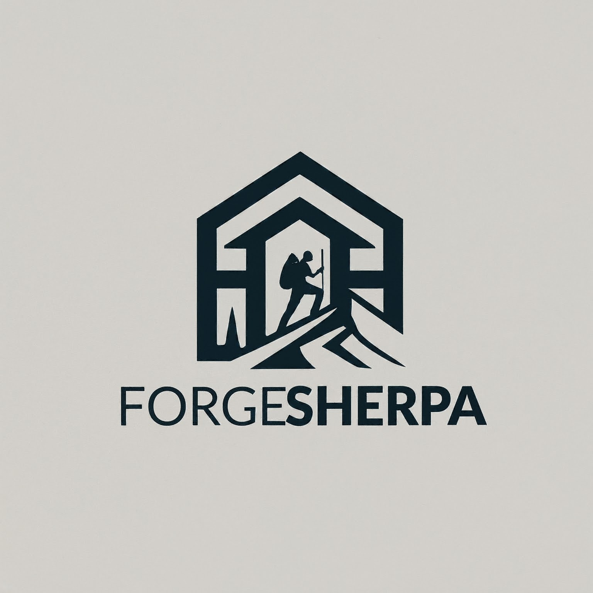

# ForgeSherpa

## The Meaning Behind ForgeSherpa
Forge: This word typically refers to a place where metal is shaped through heat and hammering. It can symbolize creation, transformation, and the crafting of something new.

Sherpa: A Sherpa is a person from the Sherpa ethnic group in Nepal, known for their expertise in mountain climbing, especially in the Himalayas. They are guides, porters, and experts in navigating challenging terrain.

Combining these two elements, "ForgeSherpa" could convey the idea of:

- Guiding through Creation: Assisting others in the process of building, shaping, or transforming something.
- Navigating the Complex: Leading and supporting individuals or teams through challenging situations.
- Crafting Solutions: Forging innovative and practical solutions to problems.

## Purpose

This organization is dedicated to creating an app as a platform to explore our abilities and 
fulfill the requirements of a given campus assignment.

## Goals

- Develop a functional app that showcases our technical skills.
- Complete the assigned project to meet academic standards.
- Collaborate effectively as a team.
- Learn and grow as developers
